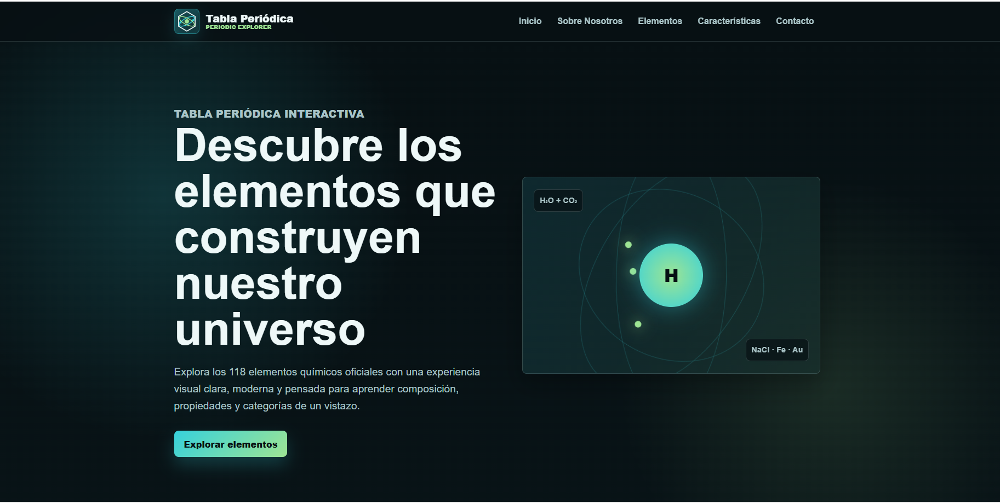
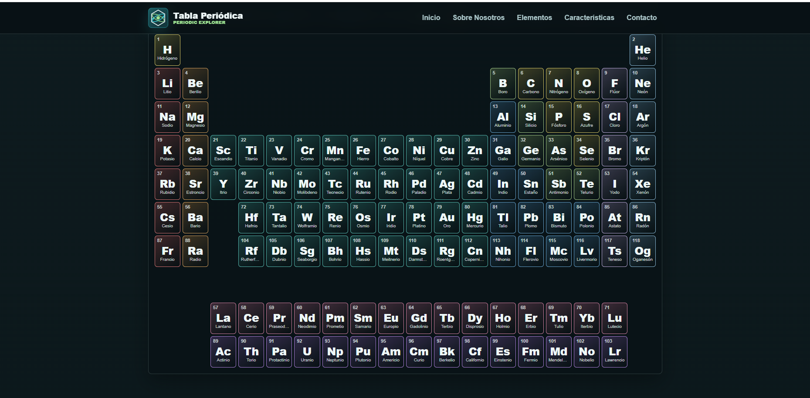
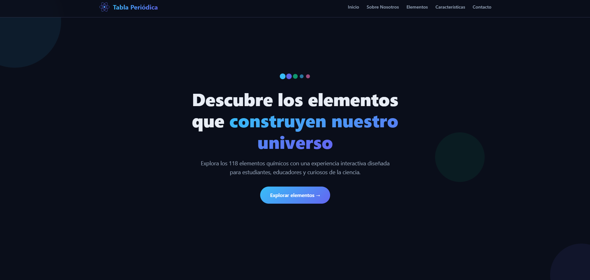
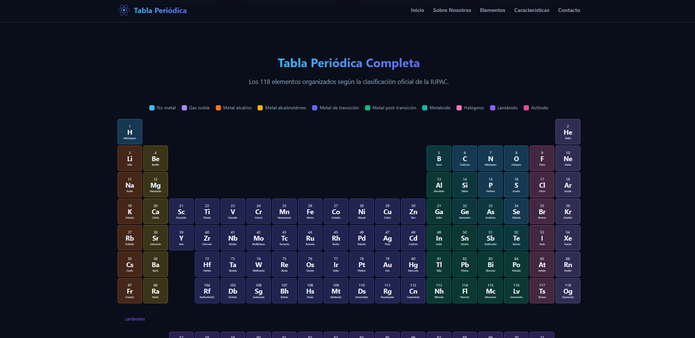

#  Proyecto Final - Landing Page Tabla Periódica (IA Agents Comparison)

##  Datos del estudiante

- Nombre: Verónica Greco
- Carrera: Tecnicatura en Desarrollo de Software
- Materia: Desarrollo de Sistemas Web (Front End)
- Comisión: D
- Fecha: Junio 2026

---

##  Deploy del proyecto

🔗 Link al proyecto unificado en Vercel:  
[Ver proyecto en línea](https://pfo-2-front-end.vercel.app/)

Este enlace dirige a la **portada principal**, desde donde se accede a:

- Prompt utilizado
- Landing Page generada por Codex
- Landing Page generada por OpenCode

---

##  Descripción del proyecto

Este proyecto consiste en la creación de una Landing Page educativa sobre la Tabla Periódica, generada mediante inteligencia artificial utilizando un único prompt de alta precisión.

El objetivo principal es **evaluar y comparar la capacidad de diferentes agentes de IA para generar código front-end de manera autónoma**, sin intervención manual sobre el resultado.

Los agentes utilizados fueron:

- Codex (GPT-5.5)
- OpenCode (Big Pickle)

Ambos generaron una Landing Page basada en el mismo prompt inicial.

---

##  Prompt utilizado

El siguiente es el prompt exacto utilizado para ambos agentes:

Actúa como un desarrollador Senior Front-End y diseñador UI/UX experto. 
Objetivo principal
Generar una Landing Page completa llamada: "Tabla periódica" 
La página debe representar una experiencia educativa moderna centrada en la Tabla Periódica y los elementos químicos.
REQUISITO CRÍTICO DE SALIDA
Generar UN SOLO ARCHIVO: index.html 
Reglas estrictas: Todo debe existir dentro de un único archivo HTML. El CSS debe estar embebido dentro de etiquetas . 
El JavaScript debe estar embebido dentro de etiquetas . No crear archivos CSS externos. No crear archivos JavaScript externos. 
No crear carpetas adicionales. No generar directorios assets. No dividir el proyecto en múltiples archivos. La salida debe ser únicamente el código HTML completo y funcional. 
Estilo visual: El diseño debe transmitir: Moderno Científico Interactivo Educativo Limpio Profesional Responsive 
Utilizar una paleta de colores inspirada en ciencia y tecnología. 

Secciones obligatorias 
1. Header Incluir: Logo con texto: "Tabla periódica" Menú de navegación responsive 
Opciones: Inicio Sobre Nosotros Elementos Características Contacto 
2. Hero Section Debe incluir: Título principal: "Descubre los elementos que construyen nuestro universo" 
Texto descriptivo breve. Botón CTA: "Explorar elementos" Agregar elementos visuales relacionados con ciencia o química.
3. Sección Sobre Nosotros Incluir: Breve explicación sobre química y la importancia de la tabla periódica 
Objetivo educativo de la plataforma 
4. Sección de Características Crear 4 tarjetas: Elementos interactivos Categorías de elementos Información atómica 
Recursos educativos. Cada tarjeta debe contener: Ícono Título Descripción 
5. Tabla Periódica Completa. Crear una representación visual completa de la tabla periódica con los 118 elementos químicos oficiales. 
Requisitos: * Incluir todos los elementos desde Hidrógeno (H) hasta Oganesón (Og). * Cada elemento debe mostrar:
* Número atómico * Símbolo * Nombre * Organizar los elementos respetando la estructura real de la tabla periódica. 
*Diferenciar visualmente las categorías mediante colores distintos. Categorías sugeridas: * Metales alcalinos
* Metales alcalinotérreos * Metales de transición * Metales post-transición * Metaloides * No metales * Halógenos 
* Gases nobles * Lantánidos * Actínidos 
Agregar interactividad mediante JavaScript: * Efecto hover sobre elementos * Mostrar información adicional al pasar el cursor o hacer clic: * Masa atómica * Grupo * Período * Categoría 
6. Testimonios Generar 3 testimonios ficticios de estudiantes o docentes. 
7. Formulario de contacto Incluir: Nombre Email Mensaje Botón enviar No requiere backend. 
8. Footer Incluir enlaces visuales a: GitHub (ícono) LinkedIn (ícono) Instagram (ícono) Twitter/X (ícono) 

Requisitos técnicos: HTML semántico Diseño responsive CSS embebido JavaScript embebido Scroll suave Efectos hover 
Animaciones suaves Diseño mobile-first Buenas prácticas de accesibilidad 
Restricciones: No realizar preguntas adicionales. No generar TODO ni contenido incompleto. No dividir el proyecto en
varios archivos. No utilizar dependencias externas innecesarias. Generar una solución completamente funcional. 
Entregar únicamente el código final del archivo HTML completo.

## Capturas de pantalla
Landing Page generada por Codex

Landing Page generada por OpenCode

